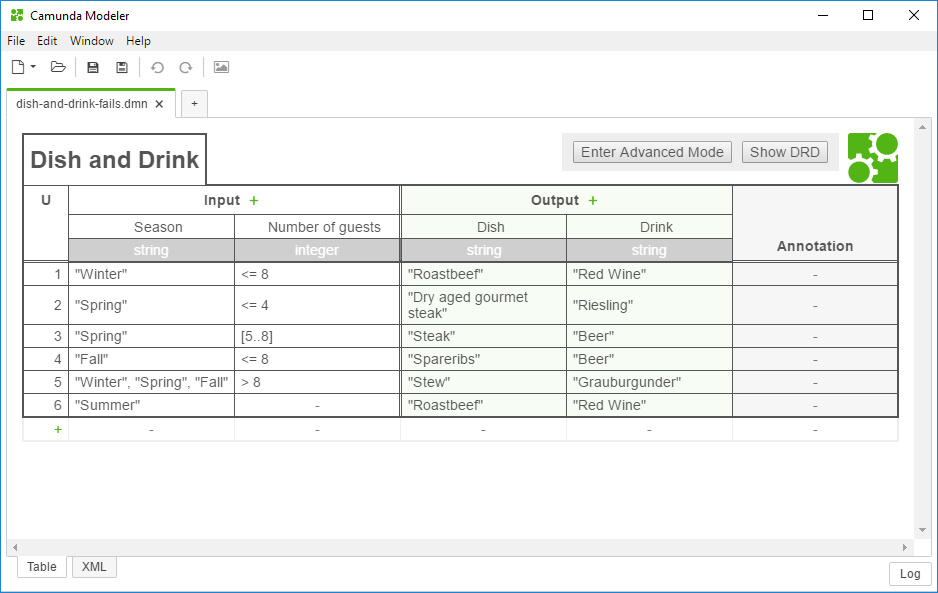
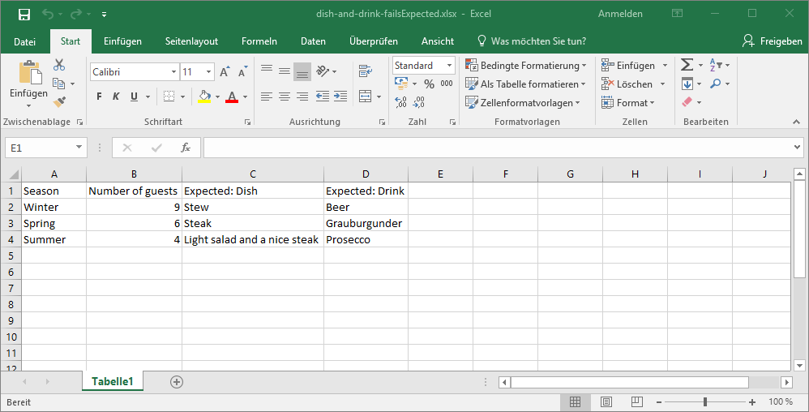
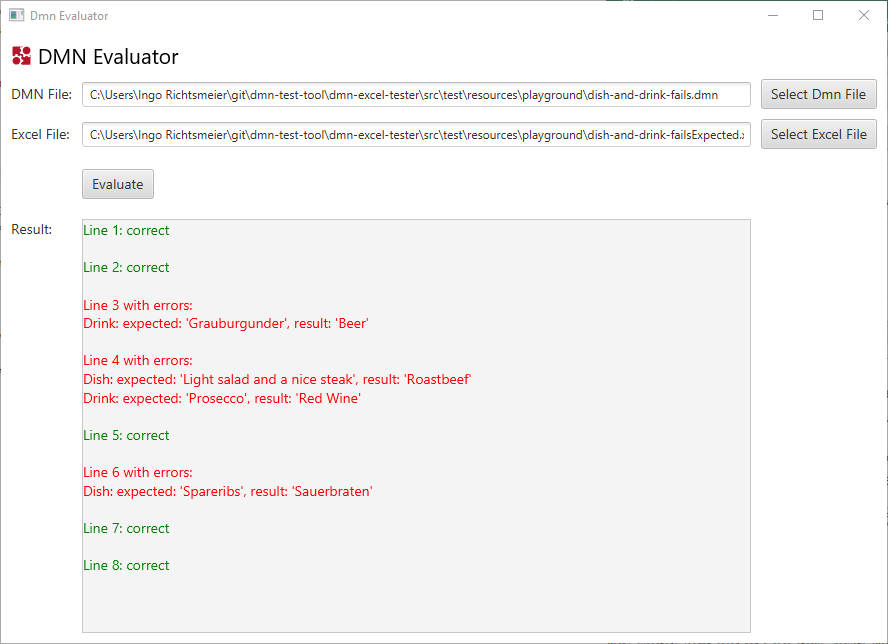
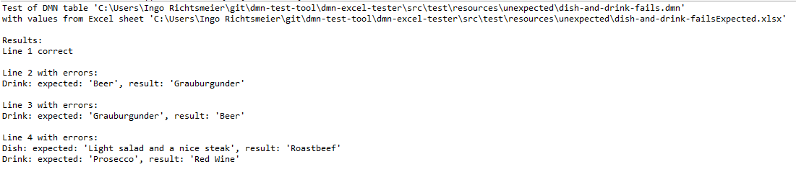

Test DMN Tables with data from Excel
====================================

With this tool you test your DMN decision table against the data from an Excel sheet.

The Excel sheet has to be structured like the decision table:
A Header line contains the input and output names from the decision tables. The output names must be preceded with `Expected: `

You can open the User Interface of the DMN Evaluator by double-clicking the `dmn-evaluator.jar` and upload the DMN table and the excel sheet to evaluate the decisions with the given values. Inspect the results:

For background testing you can run the java program `com.camunda.consulting.dmn_excel_tester.DmnExcelTester` with the filenames of the dmn table and the excel sheet from the console and check the outputs for the result.

## Build and run

Run `mvn clean compile test assembly:single` to create a single jar.

You can ignore the warning from the maven build, as the project only delivers a single jar file and nothing else.

Start the evaluation with `java -jar target\dmn-evaluator.jar dmnFile excelFile`.

## Prerequistites

This need at least Java 8 to build and run.